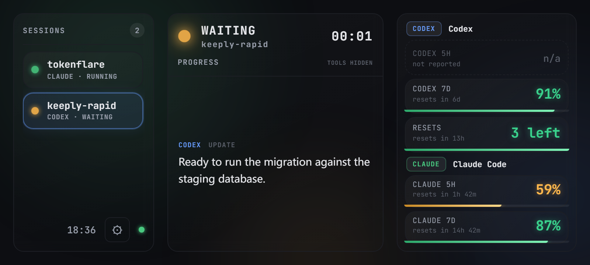
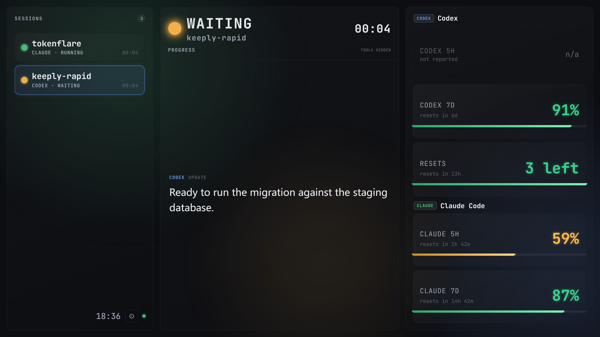

<div align="center">

# 🔥 Tokenflare

> :warning: **Not affiliated with [JumpsecLabs/TokenFlare](https://github.com/JumpsecLabs/TokenFlare)** — an unrelated AiTM security-testing tool that happens to share a similar name. Tokenflare (this project) is a read-only status dashboard for AI coding agents and never transmits your credentials anywhere.

**A visual dashboard for vibe coding with Codex & Claude Code.**

See your agent's task status at a glance (a glowing traffic light), watch your
Codex 5h/7d quota and remaining reset credits drain in real time, and track
your Claude Code usage — all on a dedicated always-on display. Point a browser
at it, or repurpose an old phone into a desk status panel.

[](LICENSE)
[](https://nodejs.org)
[](#platforms)
[](#testing)

</div>

---

## ✨ What you get

| | |
|---|---|
| 🟢🟡🔴 **Traffic-light task status** | A glowing dot + status word: *running / waiting / failed / done*. Pulsing glow in green/amber/red/blue. Driven by real Codex & Claude Code lifecycle hooks. |
| 💬 **Visible progress stream** | Switch between Codex and Claude Code; only one provider is shown at a time, even when both run concurrently. Hidden reasoning, `thinking` blocks, tool calls, inputs, and outputs are never displayed. |
| ⏳ **Codex 5h / 7d quota** | Live remaining % for both windows, straight from OpenAI's `wham` API, with reset-time hints. |
| 🔁 **Codex reset count** | How many rate-limit reset credits you still have. |
| 🤖 **Claude Code quota** | Live 5h and 7d remaining with reset times — the same numbers `/usage` shows, read via your local Claude Code login. |
| 🎨 **Cool customizable look** | Neon-dark default + 5 themes (Nord, Tokyo Night, Catppuccin, Gruvbox, Synthwave), 3 fonts (JetBrains Mono / Inter / system), animated gradient-mesh / aurora background, reduced-motion toggle. All persisted on the phone. |
| 🔒 **Private by design** | Hooks forward an allow-list of fields only — prompts, tool input/output, reasoning and transcripts never leave the agent. Text shaped like a real credential (API keys, tokens, JWTs, private keys) is stripped before it reaches the phone. |
| 🚫 **No invented numbers** | Every percentage on the wall came from a live API call. No provider data means the card says *not connected*; an unreported window says *n/a*. |

---

## 📸 Screenshots

<p align="center">
  
</p>

<p align="center"><sub>Two concurrent sessions, one waiting on approval; live 5h/7d quota for both providers.<br>
The Codex 5h window reads <i>n/a</i> because ChatGPT doesn't report it for this plan — never a made-up number.</sub></p>

<details>
<summary>Larger displays</summary>

<p align="center">
  
</p>
</details>

> Regenerate these with `node e2e/shot.mjs` — it boots the real server with
> representative state and captures all three viewports.

---

## 🚀 Quickstart (60 seconds)

```bash
git clone https://github.com/leiseek/tokenflare.git
cd tokenflare

# Windows
.\install.ps1

# macOS / Linux
./install.sh

# Start the server (prints your phone URL in a banner)
npm start
```

You'll see:

```
┌──────────────────────────────────────────────┐
│  Tokenflare server is up                    │
│  local:   http://127.0.0.1:7331
│  phone:   http://192.168.1.10:7331            │   ← open this on your phone
│  ws:      /ws                                 │
│  codex:   auto-read ~/.codex/auth.json        │
└──────────────────────────────────────────────┘
```

On the phone (same Wi-Fi): open that URL → **Add to Home Screen** → launch
full-screen in landscape. You're done.

During installation, Tokenflare asks whether Codex quota requests need a
proxy. If so, choose HTTP or SOCKS5, then enter the proxy IP and port. Re-run
the installer anytime to keep, change, or disable that setting.

> **Not logged in yet?** The display still works. A provider you're not logged
> into reads *not connected* rather than showing invented numbers — Tokenflare
> never fabricates a percentage. Quota appears automatically once you log in:
> the server reads `~/.codex/auth.json` for Codex and
> `~/.claude/.credentials.json` (the login Keychain on macOS) for Claude Code.
> Neither file is ever written to, and neither token leaves the server process.

---

## 🔌 Wiring real agent hooks (for live task status)

The installer offers to connect every detected client automatically. Without
hooks you still get quota display; with hooks you also get live traffic-light
task status.

**Windows (PowerShell):**
```powershell
.\scripts\register-codex-hook.ps1
.\scripts\register-claude-hook.ps1
# Use the pure-PowerShell shim if node isn't on PATH at hook time:
.\scripts\register-codex-hook.ps1 -UsePowerShellShim
```

**macOS / Linux (bash):**
```bash
./scripts/register-codex-hook.sh
./scripts/register-claude-hook.sh
# Use the pure-bash (curl) shim if node isn't on PATH at hook time:
./scripts/register-codex-hook.sh --sh bash
```

Remove anytime: `unregister-codex-hook.{ps1,sh}` / `unregister-claude-hook.{ps1,sh}`.

> The hook forwarder is **fail-open**: it always exits 0 within 1 second. If
> the display server is offline, your agent is completely unaffected. It also
> strips prompts and tool input/output before transmitting the lifecycle event.
> The default Node shim may additionally send the latest provider-visible
> assistant update; it never sends hidden reasoning or tool blocks.
> Codex may ask you to trust the local command hooks the first time they run.

---

## 🗂 Layout

```
+------------------+---------------------------+----------------------+
| SESSIONS    2    | ● RUNNING  tokenflare 4:12| Codex 5h       78%   |
| ● tokenflare CODEX| PROGRESS · TOOLS HIDDEN   | Codex 7d       91%   |
| ● other CLAUDE 0:03| Checking the real Codex  | Resets       2 left  |
|                  | hook mapping and client   | Claude 5h      38%   |
| 12:34  ⚙         | registration…             |                      |
+------------------+---------------------------+----------------------+
```

The left rail lists every active tool/session (each with its own project name + status + elapsed). Tap a card to pin the progress panel to that instance — only its **latest** visible assistant update is shown. Codex Desktop sessions are tracked automatically by tailing their transcripts (no hooks needed). Tap the ⚙ gear to switch theme, font, background, reduced-motion, or server URL.

---

## ⚙️ Configuration

`config/tokenflare.config.json` holds machine-specific values (your proxy), so
it is **gitignored**. The installer creates it from
[`config/tokenflare.config.example.json`](config/tokenflare.config.example.json)
on first run; copy it by hand if you skip the installer. Every field is
optional — the server boots on defaults with no config file at all.

```jsonc
{
  "server": { "host": "0.0.0.0", "port": 7331 },
  "proxy": null,                     // installer can configure HTTP or SOCKS5
  "codex": {
    "autoReadAuthJson": true,        // read ~/.codex/auth.json automatically
    "pollSeconds": 300,              // quota refresh interval
    "watch": true,                   // tail ~/.codex/sessions for Desktop sessions
    "watchIntervalMs": 3000
  },
  "claude": {
    "autoReadCredentials": true,     // read ~/.claude/.credentials.json (Keychain on macOS)
    "pollSeconds": 300,
    "accountName": "Claude Code"     // shown above the Claude cards
  },
  "display": { "defaultTheme": "neon-dark", "defaultFont": "jetbrains" }
}
```

There are no fallback percentages to configure. A provider with no live data
shows *not connected*, and a window the provider doesn't report shows *n/a* —
by design, so a number on the wall is always a real number.

Env overrides: `TOKENFLARE_HOST`, `TOKENFLARE_PORT`, `TOKENFLARE_CODEX_POLL`,
`TOKENFLARE_CODEX_WATCH`, `TOKENFLARE_CLAUDE_POLL`,
`TOKENFLARE_CLAUDE_CREDENTIALS`, `TOKENFLARE_PROXY`, `HTTPS_PROXY`,
`HTTP_PROXY`, `TOKENFLARE_CONFIG`, `TOKENFLARE_PWA_DIR`.
See [`docs/specs/2026-07-24-tokenflare-design.md`](docs/specs/2026-07-24-tokenflare-design.md)
for the full design.

---

## 🧪 Testing

```bash
npm run typecheck   # strict TypeScript, zero errors
npm test            # 99 unit tests (hooks, sanitize, reducer, metrics, store, quota, watcher, sweeper)
npm run test:e2e    # 14 Playwright e2e tests (hook -> server -> WS -> rendered DOM)
```

Both suites are offline: the e2e config disables every credential read and
network fetch, so CI never depends on OpenAI or Anthropic being reachable.

## 📋 Manual self-test checklist

1. `install.{ps1,sh}` then `npm start` → banner prints your LAN URL.
2. Open the URL on the phone (or a desktop browser in a narrow landscape window) → neon-dark hero + 5 quota cards.
3. `curl -X POST .../api/hooks/codex -d '{"hook_event_name":"SessionStart","session_id":"t1","cwd":"D:/proj"}'` → hero turns **green / RUNNING** and a session card appears.
4. `curl -X POST .../api/hooks/codex -d '{"hook_event_name":"PermissionRequest","session_id":"t1","cwd":"D:/proj"}'` → hero turns **amber / WAITING**.
5. POST a second provider (`/api/hooks/claude ...`) → a second session card appears alongside the first; tap either to switch the progress panel.
6. `curl -X POST .../api/quota/mock -d '{"codex":{"fiveHour":{"remaining":8}},"claude":{}}'` → Codex 5h card goes **red / critical**.
7. Start a real Codex Desktop session → it shows up automatically (the transcript watcher tails `~/.codex/sessions`); no hook registration needed for Desktop.
8. Tap ⚙ → switch theme to *Tokyo Night*, toggle *Reduced motion*, pick a font → changes persist across reloads.

---

## 🌐 Platforms

| Component | Windows | macOS / Linux |
|---|---|---|
| Server (Node.js) | ✅ | ✅ |
| PWA (any phone browser) | ✅ | ✅ |
| Hook registration | `scripts/*.ps1` (PowerShell) | `scripts/*.sh` (bash) |
| Fallback shim (no node on PATH) | `hook-forward.ps1` | `hook-forward.sh` (curl) |
| Install / Uninstall | `install.ps1` / `uninstall.ps1` | `install.sh` / `uninstall.sh` |

> Requires Node.js 20+. The installers check this and tell you how to upgrade.

---

## 🗺️ How it works

```
 Codex CLI / Claude Code  ──hook──▶  tokenflare server (PC)  ──WebSocket──▶  PWA (phone)
   fires lifecycle hooks            ingests + reduces state             renders traffic light
                                    fetches live Codex quota              + quota cards
```

- **Hooks** fire on `SessionStart`, `UserPromptSubmit`, `PreToolUse`,
  `PostToolUse`, `Notification`, `Stop`. A fail-open shim forwards a
  **sanitized** copy (prompts/transcripts/secrets stripped) to the server.
- The server **reduces** events into a task state with terminal-protection
  (a stale late event can't resurrect a failed task; `Stop` ≠ done).
- **Live Codex quota** comes from OpenAI's `wham` endpoints, auto-reading your
  Codex CLI OAuth tokens.
- The phone renders a **snapshot/delta** stream over WebSocket; on reconnect it
  resyncs via a full snapshot — flaky Wi-Fi won't blank the screen.

---

## 🛠️ Troubleshooting

<details>
<summary><b>The phone can't open the URL</b></summary>

- Make sure the phone is on the **same Wi-Fi** as the PC.
- Check your PC firewall isn't blocking port `7331` (the default).
- Use the LAN IP from the banner, not `127.0.0.1` (that only works on the PC itself).
- If the server bound to `127.0.0.1` only, set `TOKENFLARE_HOST=0.0.0.0` and restart.
</details>

<details>
<summary><b>"port 7331 is already in use"</b></summary>

Another process (often a previous server instance) holds the port. `npm start`
and `npm run dev` automatically free the port first (via a `prestart` hook that
kills the old listener), so this is usually already handled. To free it manually
or force a clean restart:

```bash
npm run kill-port      # just free the port
npm run restart        # free the port, then start fresh
# or run on a different port:
TOKENFLARE_PORT=7332 npm start
```
</details>

<details>
<summary><b>A provider's cards say "not connected"</b></summary>

That means no live data — Tokenflare will not invent a number to fill the gap.

- **Codex**: run `codex` once and log in so it writes `~/.codex/auth.json`.
  Check the console for `[codex] codex wham failed: ...`.
- **Claude Code**: run `claude` once and log in so it writes
  `~/.claude/.credentials.json` (macOS stores it in the login Keychain
  instead). Check the console for `[claude] claude usage failed: ...`.

`auth rejected (403)` on a working login usually means the request left from a
region the provider doesn't serve — set a proxy (see [Configuration](#-configuration)).
</details>

<details>
<summary><b>The Codex 5h card says "n/a — not reported"</b></summary>

Not a bug. ChatGPT does not return a 5-hour window for every plan; when
`/usage` omits it, the card says so rather than disappearing (which read as
breakage) or showing a fabricated value. The 7d card and reset credits are
unaffected.
</details>

<details>
<summary><b>The session rail keeps growing / sessions stay "RUNNING" forever</b></summary>

Fixed in 0.2.0. Sessions that stop reporting are demoted to `idle` after 5
minutes and dropped from the rail after an hour. If you still see this, you are
running an older build — rebuild with `npm run build`.
</details>

<details>
<summary><b>bash scripts fail with <code>bash\r: No such file or directory</code></b></summary>

The scripts got CRLF line endings (e.g. edited on Windows). `.gitattributes`
forces `.sh` to LF — run `git add --renormalize .` and re-checkout. Or run
`dos2unix scripts/*.sh install.sh uninstall.sh`.
</details>

<details>
<summary><b>Settings (theme/font) don't persist</b></summary>

They're stored in the phone browser's `localStorage`. Private/incognito mode,
or clearing site data, resets them. They're per-device by design.
</details>

---

## 🔒 Privacy

- Hooks keep only lifecycle metadata plus an optional, bounded visible assistant
  update extracted locally. Hidden reasoning and all tool content are excluded.
- Payloads containing secret markers (`api_key`, `bearer`, `authorization`, …)
  are **hard-rejected** with HTTP 400. The error logs the key *name*, never the value.
- OAuth tokens and transcript files stay on the PC; the phone receives status,
  quota numbers, and the bounded visible progress entries.
- See [`SECURITY.md`](SECURITY.md) for the full model.

---

## 📦 Uninstall

```bash
# Windows
.\uninstall.ps1                  # remove build artifacts
.\uninstall.ps1 -RemoveHooks     # also unregister agent hooks (prompts)

# macOS / Linux
./uninstall.sh                   # remove build artifacts
./uninstall.sh --remove-hooks    # also unregister agent hooks (prompts)
```

Source, config, and docs are never deleted.

---

## 🤝 Contributing

Contributions welcome! Read [`CONTRIBUTING.md`](CONTRIBUTING.md) first. In short:
open an issue to discuss, match the code style, add tests, keep `typecheck` +
`npm test` + `npm run test:e2e` green, follow Conventional Commits.

## 📄 License

[MIT](LICENSE) — © tokenflare contributors.

---

<div align="center">

A glowing panel for your vibe coding sessions. 🔥

</div>
